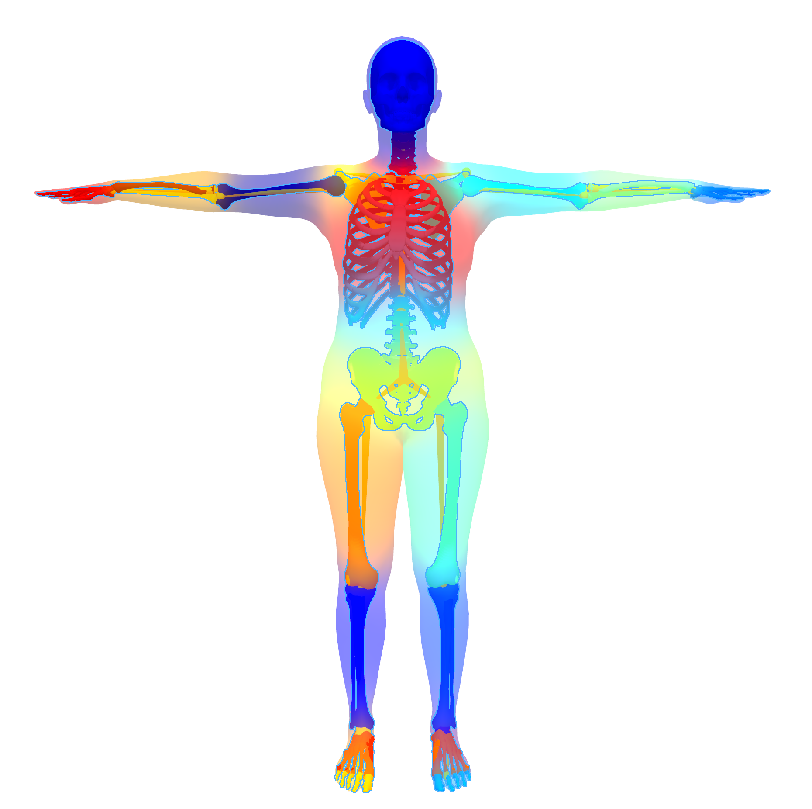
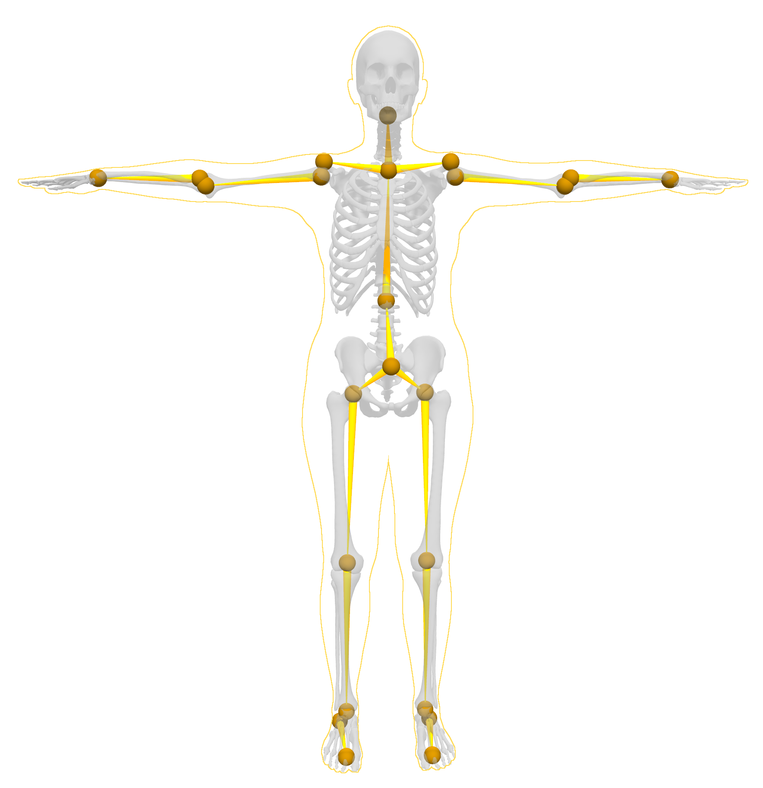

## SKEL


This repository is part of the code release for the Siggraph Asia 2023 paper "From Skin to Skeleton: Towards Biomechanically Accurate 3D Digital Humans". 

[[paper](https://download.is.tue.mpg.de/skel/main_paper.pdf)] [[project page](https://skel.is.tue.mpg.de/)]

### News
- **2025/08/15**: The installation was simplified and the code and dependancies were updated to work on python3.12.

----

This repo contains the pytorch SKEL loader and the code to align it to SMPL sequences.

SKEL is a parametric body shape and skeleton model. Its shape parameter **θ** lets you change the body shape and its pose parameter **q** lets you pose the skeleton and skin in an anatomically plausible way. Given shape and pose parameters, SKEL returns joint locations, a body mesh, and a skeleton mesh. SKEL is differentiable and can be fit to various data like motion capture or SMPL sequences.

For more details, please check our Siggraph 2023 paper: [From Skin to Skeleton: Towards Biomechanically Accurate 3D Digital Humans](https://download.is.tue.mpg.de/skel/main_paper.pdf).

## Table of Contents

- [Quickstart](#quickstart)
- [Installation](#installation)
  - [Set up the environment](#set-up-the-environment)
  - [Downloading SKEL](#downloading-skel)
  - [Aitviewer](#aitviewer)
  - [SMPL and Mesh package](#smpl-and-mesh-package)
- [Demos](#demos)
  - [Pose parameters](#pose-parameters)
  - [Shape space](#shape-space)
  - [Rigging](#rigging)
  - [SKEL sequence](#skel-sequence)
  - [Aligning SKEL to SMPL mesh](#aligning-skel-to-a-smpl-mesh)
  - [Aligning SKEL to SMPL sequences](#aligning-skel-to-smpl-sequences)
- [Acknoledgments](#acknoledgments)
- [Citation](#citation)
- [License](#license)
- [Contact](#contact)

## Quickstart

For a minimal use, you will have to follow the install instructions in [Set up the environment](#set-up-the-environment) and [Downloading SKEL](#downloading-skel).

To test the SKEL model, you can then run:
```shell
python quickstart.py 
```
This runs the forward pass of SKEL and saves the output as separated body and skeleton meshes.

You can then try to change the SKEL parameters knowing the following. SKEL is controled by two parameters:

- `betas` controls the shape of the body (tall, small, skinny, etc...). It is a vector of size 10. The values should remain between -2 and 2. The first value of the vector roughly controls the height, the second value the weight.

- `pose` controls the body pose. It is a vector of size 46, most values are angles expressed in radian, and can vary between -3.14 and 3.14. You can see which of the 46 parameters controls which body articulation [here](https://github.com/MarilynKeller/SKEL/blob/21e1b6aad914cc2910d12cf2715784ef90c5f137/skel/kin_skel.py#L29) .

SKEL(beta, pose) yields:
- A skeleton 3D mesh
- A body mesh
- Anatomical joint locations

The rest of this readme will let you setup our SKEL vizualizer and run some demo code. We hope you enjoy our work!


## Installation

### Set up the environment
Clone this repository

```shell
git clone https://github.com/MarilynKeller/SKEL
cd SKEL
```

Create a virtual environment and install the SKEL package
```shell
bash install.sh 
```

Source the virtual environment
```shell
source skel_venv/bin/activate
```


### Downloading SKEL

Create an account on https://skel.is.tue.mpg.de/ and https://smpl.is.tue.mpg.de/. The following script will ask for your login and password for each of these website to download the data.

Then run:
```shell
bash fetch_skel.sh
```

If this fails, you can also download the data manually from the [SKEL download page](https://skel.is.tue.mpg.de/download) and the [SMPL download page](https://smpl.is.tue.mpg.de/download) and place them in the `data` folder of this repository. The expected structure is:

```
SKEL/ # Root of the repository
└── data/
    └── skel/
        ├── skel_female.pkl
        ├── skel_male.pkl
        └── ...

```
For running the demos other than the quickstart you will need the following.

### SMPLH and MPI Mesh package


#### SMPL

If you want to run an alignment to a SMPL body or sequence, you need to download the SMPL model.

First, create an account on https://smpl.is.tue.mpg.de/.
Then run the following script to download the SMPL model:

```shell
bash fetch_smpl.sh
```

#### SMPLH

SMPLH is a version of SMPL with the parametric hands from MANO. The AMASS dataset is in this format. To view the sample AMASS sequence in aitviewer, you need to download the SMPLH model.

First, create an account on https://mano.is.tue.mpg.de/.
Then run the following script to download the SMPLH model:

```shell
bash fetch_smplh.sh
```

If it fails, you can also download the data manually from the download pages of https://smpl.is.tue.mpg.de/ and https://mano.is.tue.mpg.de/, and place them in the `data` folder of this repository. Note that SMPLH files require pre-processing, done by the `fetch_smplh.sh` script. 


The final expected structure for these models is:

``` 
SKEL/ # Root of the repository
└── data/
    ├── skel/
    │   ├── skel_female.pkl
    │   ├── skel_male.pkl
    │   └── ...
    └── smpl/
        ├── SMPL_FEMALE.pkl
        ├── SMPL_MALE.pkl
        └── SMPL_NEUTRAL.pkl
    └── smplx/
        ├── SMPLH_FEMALE.pkl
        ├── SMPLH_MALE.pkl
        └── SMPLH_NEUTRAL.pkl
```

### Interactive visualization of the fits

For visualizing the fitting process you need the MPI mesh package, you can install it with the following line:

! Note that the MPI mesh package is only supported on Linux systems.

```shell
pip install git+https://github.com/MarilynKeller/mesh
```

## Demos


### Shape space
Vizualize the shape space:

```shell
python examples/skel_betas.py --gender female 
```

### Pose parameters
Visualize the effects of the pose parameters of SKEL:

```shell
python examples/skel_poses.py --gender male
```


### Rigging
Visualize the skinning weights of the skin and bones to the SKEL kinematic tree:


```shell
python examples/skel_rigging.py --gender female  
```



Visualize the kinematic tree and joint locations of SKEL:

```
python examples/skel_kintree.py --gender female
```



You can see a visual of the joint ids [here](assets/skel_kin_tree_nb.jpg) and their names and the list of degrees of freedom [here](skel/kin_skel.py)

### SKEL sequence
Visualize a SKEL sequence. You can find a sample SKEL motion in `data/skel/sample_motion/ ` and the corresponding SMPL motion.

```shell
python examples/skel_sequence.py data/skel/sample_motion/01_01_poses_skel.pkl -z 
```

To visualize the SMPL sequence alongside : 
```shell
python examples/skel_sequence.py /path/to/skel_models_v1.0/sample_motion/01_01_poses_skel.pkl -z --smpl_seq /path/to/skel_models_v1.0/sample_motion/01_01_poses.npz
```

## Aligning SKEL to a SMPL mesh

SKEL can be aligned to SMPL meshes:

```shell
python examples/align_to_SMPL_frame.py --smpl_data 'examples/samples/img_fit/emily-sea-coiWR0gT8Cw-unsplash_0.npz' 
```

## Aligning SKEL to SMPL sequences

SKEL can be aligned to SMPL sequences, here is an example:

```shell
python examples/align_to_SMPL_seq.py examples/samples/amass_seq/CMU_01_01.npz -D 
```

You can visualize the result with:

```shell
python examples/skel_sequence.py output/CMU_01_01/CMU_01_01_skel.pkl -z 
```

You can download more SMPL sequences of this kind from the [AMASS](https://amass.is.tue.mpg.de/) Download page, and selecting the `SMPL+H G` sequences.


## Acknowledgments
This research was done partly at [The Movement Lab](https://tml.stanford.edu/) in Stanford and [Perceiving Systems](https://ps.is.mpg.de/) at the Max Planck Institute for Intelligent Systems.

We thank Neelay Shah for generating all the necessary SMPL fits, A. A. Osman for his expertise on parametric body models, Shashank Tripathi for his help with MOYO, Giorgio Becherini for his expertise on AMASS and mocap fit evaluation, Peter Kultis, Yao Feng and Yuliang Xu for feedbacks on the paper.
We also thank the TML lab and the NMBL lab at Stanford for the fruitful discussions, especially Jennifer Maier for her expertise on the shoulder.

## Citation
If you use this software, please cite the following work and software:

```latex
@inproceedings{keller2023skel,
  title = {From Skin to Skeleton: Towards Biomechanically Accurate 3D Digital Humans},
  author = {Keller, Marilyn and Werling, Keenon and Shin, Soyong and Delp, Scott and 
            Pujades, Sergi and Liu, C. Karen and Black, Michael J.},
  booktitle = {ACM ToG, Proc.~SIGGRAPH Asia},
  volume = {42},
  number = {6},
  month = dec,
  year = {2023},
}
```

### License

This code and model are available for non-commercial scientific research purposes as defined in the [LICENSE.txt](LICENSE.txt) file.


## Contact 

For any questions about SKEL loading, please contact skel@tuebingen.mpg.de.

For commercial licensing, please contact ps-licensing@tue.mpg.de
